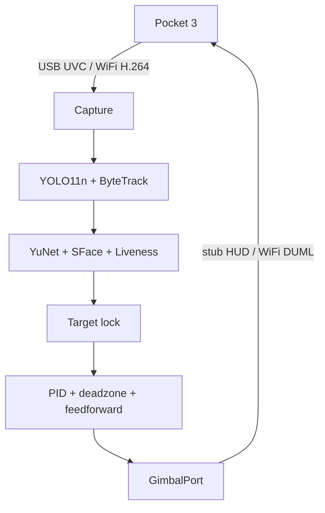

# PocketShow

本地闭环的 **DJI Osmo Pocket 3 智能跟拍**：从视频流里检出人、锁住身份，再把画面误差转成云台速度。

[](https://www.python.org/)
[](#环境要求)
[](#状态)

Pocket 3 没有官方第三方 SDK。PocketShow 把 **USB Webcam 取流**（画质好、延迟低）和 **WiFi DUML 云台控制**拼成一条可替换的管线；检测、识别、决策与传输层解耦。

> **非官方项目，与 DJI 无任何关联。** 云台协议来自社区对 DUML 的逆向，行为可能随固件变化。仅供个人研究与本地使用。

## 能力

- **取流**：USB UVC、相机 WiFi H.264（需 `ffmpeg`）、本地文件回放；`auto` 会优先识别 Pocket 3
- **检测与跟踪**：YOLO11n 只检 `person`，ByteTrack 维持 ID
- **身份**：YuNet 人脸 + SFace 特征；锁定后即使 ByteTrack ID 跳变也会接回同一个人
- **活体**：MiniFASNet，拦纸质照片和屏幕翻拍
- **跟拍**：死区 + PID + 速度前馈；短暂遮挡衰减最后速度，超时才重选目标
- **云台**：`stub` 只在预览 HUD 上画 yaw/pitch；`wifi` 经 UDP 9004 发 DUML
- **人物库**：本地管理页改名、合并重复档、上传底片、查入镜日志；可选工位离岗提醒

## 管线



`GimbalPort` 只暴露 `set_velocity` / `recenter` / `close`。换传输层不必动检测和决策。

Webcam 模式有可能与 WiFi 控制互斥：若云台无响应，把取流改成 `--source wifi`，决策层不用改。

## 环境要求

| 项 | 说明 |
|----|------|
| Python | 3.11+ |
| 系统 | macOS（Apple Silicon 走 MPS） |
| 相机 | Pocket 3 用数据线开 Webcam，或连相机 WiFi 热点 |
| 可选 | WiFi 视频回退需要本机 `ffmpeg` |

首次运行会下载 `yolo11n.pt`，以及人脸 / 活体模型到 `~/.pocketshow/models/`。macOS 需在 **系统设置 → 隐私与安全性 → 摄像头** 中允许终端或 Python。

## 安装

```bash
git clone https://github.com/showx/PocketShow.git
cd PocketShow
python3 -m venv .venv
source .venv/bin/activate
pip install -e ".[dev]"
```

## 快速开始

笔记本摄像头或 Pocket 3 USB，云台打到预览上（电机不转）：

```bash
pocketshow --config configs/default.yaml --gimbal stub
```

文件回放：

```bash
pocketshow --source file --file /path/to/clip.mp4 --gimbal stub
```

接到 Pocket 3 云台（先在相机上打开 WiFi AP，或加 `--ble`）：

```bash
pocketshow --gimbal wifi --join-wifi --ssid OsmoPocket3-XXXX --password 'your-password'
```

USB 画面无响应时，改走 WiFi 720p 流：

```bash
pocketshow --source wifi --gimbal wifi --join-wifi --ssid OsmoPocket3-XXXX --password 'your-password'
```

### 预览快捷键

| 按键 | 作用 |
|------|------|
| 鼠标点人物框 | 锁定该人（有姓名后，跟踪 ID 变了也会接回） |
| `n` / `p` | 下一个 / 上一个目标 |
| `e` | 把当前锁定目标的人脸登记进 `data/faces.json` |
| `c` | 清除锁定，回到「画面里最大的人」 |
| `r` | 云台回中 |
| 空格 | 停转 |
| `q` / `Esc` | 退出 |

绿框是锁定目标，白框是其他人，黄框是人脸。自动登记会标成「人物A / 人物B…」，并裁一张脸部相片留底。关闭识别：把配置里 `recognize.enabled` 设为 `false`。

## 人物库与管理页

跟拍时会把人脸封面存到 `data/faces/`。本地打开管理页，可以改名、看底片、上传照片、删除：

```bash
pocketshow-admin
```

默认地址 [http://127.0.0.1:8765](http://127.0.0.1:8765)。跟拍进程不用关；网页里改的名字，预览里过几秒会跟上。

- 同一人被拆成两条时，打开卡片选 **并入** 即可合并
- **入镜日志** 记录每次入镜、离镜和停留时长
- 右下角 **镜头** 十字键可手动左右 / 上下转：按住就转，松开就停，键盘方向键同样有效；**跟拍** 交回自动锁定
- `--gimbal stub` 时只在预览 HUD 上看到 yaw/pitch；电机真转需 `--gimbal wifi`

工位看护（`watch`）可在上班时段检测离岗，阈值与工作日在配置或管理页里改。

## 配置

主配置见 [`configs/default.yaml`](configs/default.yaml)。跟拍不是把人死锁在画面中心：`deadzone` 内不推云台；ByteTrack 速度做前馈；短暂遮挡衰减最后速度，超时才重选。

| 段 | 关键项 |
|----|--------|
| `capture` | `source`（`auto` / `usb` / `file` / `wifi`）、分辨率、帧率 |
| `detect` | YOLO 权重、`conf`、设备（`auto` / `mps` / `cpu`） |
| `follow` | `deadzone`、PID、`feedforward`、丢失保持 / 超时 |
| `recognize` | 匹配阈值、自动登记、活体开关、人物库路径 |
| `gimbal` | `stub` 或 `wifi` |
| `wifi` | 相机 IP / 端口、SSID、BLE 唤醒、视频分辨率 |
| `watch` | 上班时段、离岗秒数 |

命令行覆盖配置，常用参数：

```text
pocketshow [--config PATH] [--source auto|usb|camera|file|wifi]
           [--file PATH] [--device-index N]
           [--gimbal stub|wifi] [--ssid SSID] [--password PASS]
           [--ble] [--join-wifi] [--no-preview] [-v]
```

## 架构

| 模块 | 职责 |
|------|------|
| `capture` | USB / 文件 / WiFi 帧源 |
| `detect_track` | YOLO11n + ByteTrack，只要 person |
| `recognize` | YuNet 人脸 + SFace 特征，挂到人体框并给出稳定身份 |
| `liveness` | MiniFASNet 活体 |
| `gallery` / `admin` | 人物名册、相片留底、本地管理页 |
| `appear` / `watch` | 入镜日志、工位离岗 |
| `target` | ID / 身份锁定与丢失恢复 |
| `follow` | 画面误差 + PID |
| `gimbal.stub` / `gimbal.wifi` | 可替换云台口 |
| `pocket3` | DUML、UDP 9004、可选 BLE / 加入热点 |

```
src/pocketshow/
├── app.py              # CLI 主循环
├── capture.py
├── detect_track.py
├── recognize.py
├── follow.py
├── target.py
├── admin.py            # pocketshow-admin
├── gimbal/
│   ├── base.py         # GimbalPort
│   ├── stub.py
│   └── wifi.py
└── pocket3/            # DUML / UDP / BLE / 取流
```

## 状态

当前为 **0.1.0 experimental**：接口、协议字段和默认阈值都可能变。已在 macOS + Apple Silicon + Pocket 3 上自测；其他系统未作为目标平台。

已知约束：

- USB Webcam 与 WiFi 云台可能互斥，无响应时改 `--source wifi`
- 人脸库与日志默认写在仓库下的 `data/`，请勿提交个人相片
- 活体与识别都是启发式阈值，强光、侧脸、遮挡会误判

## 开发

```bash
pytest
```

欢迎 Issue 与 Pull Request。改跟拍参数请附上场景说明（室内 / 逆光 / 多人）和 `configs/` 里对应项。

## License

尚未选定开源许可证。在补上 `LICENSE` 之前，请勿默认可以二次分发或商用。
